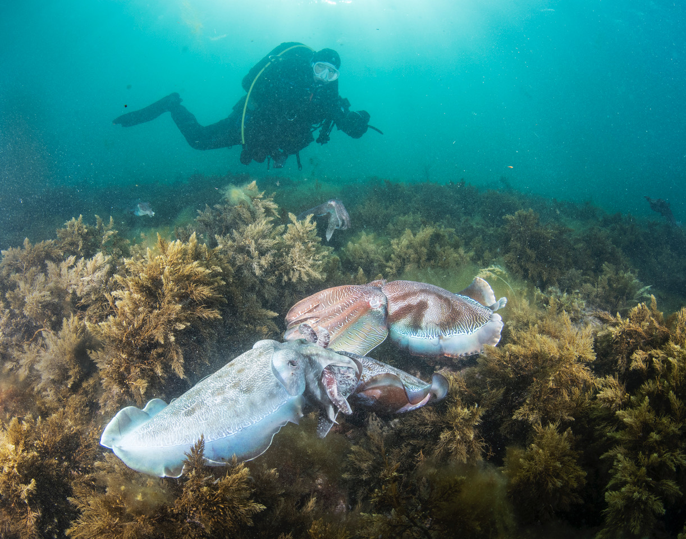
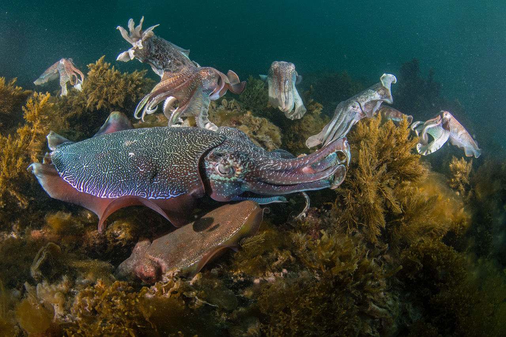

::: {w3-include-html="navsite.html"}
:::

::: {.w3-row .w3-border}
::: {.w3-container .w3-light-blue}
2019 Meetings {#meetings .w3-text-shadow .w3-center}
=============

::: {.w3-container}
### Wednesday, September 4 at 7:30 pm

Ed will show pictures from under the Blue Herron Bridge, West Palm
Beach, FL. Blue Herron is one of the great shore dives. With a maximum
depth of around 20 feet, your bottom time is usually over an hour. Blue
Herron has a tremendous variety of critters, and Ed will feature on
macro (small) ones and include larger fish.

{.w3-border
.w3-padding width="25%"}
{.w3-border
.w3-padding width="25%"}
{.w3-border
.w3-padding width="25%"}
{.w3-border
.w3-padding width="25%"}
:::

::: {.w3-container}
### Wednesday, August 7 at 7:30 pm

Gloria will show pictures of cuttlefish from a recent trip.

{.w3-border .w3-padding width="30%"}
{.w3-border .w3-padding width="30%"}
{.w3-border width="30%"}
:::

::: {.w3-container}
### Wednesday, July 10 at 7:30 pm

We will meet one week later than usual on July 10 instead of July 3 so
members can enjoy the July 4 holiday. Larry, Paul and Eric will talk
about and show slides from their February trip to Playa del Coco, Costa
Rica.

{.w3-border .w3-padding
width="30%"} {.w3-border
.w3-padding width="30%"}
{.w3-border width="30%"}
:::

::: {.w3-container}
### Wednesday, May 1 at 7:30 pm

Our meeting will be at Mylo\'s (see below for directions).

Mike will show some pictures from his photo safari in Africa. He spent a
month in South Africa including Kruger Park, Botswana, and Zimbabwa.

{.w3-border .w3-padding width="30%"}
{.w3-border .w3-padding width="30%"}
{.w3-border .w3-padding width="30%"}
:::

::: {.w3-container}
### Wednesday, April 3 at 7:30 pm

Our meeting will be at Mylo\'s (see below for directions).

Volunteers from ReefSave will talk about their work trying to remove
invasive lionfish. They have develop some interesting traps that they
deploy in deep water.

{.w3-border .w3-padding width="30%"}
{.w3-border .w3-padding width="30%"}

We will also discuss future club dive trips, including one to the
Solomon Islands, home of Guadacanal.
:::

::: {.w3-container}
### Wednesday, February 6 at 7:30 pm

**Back to our usual first Wednesday of the month meeting date.**Our
meeting will be at Mylo\'s (see below for directions).

Oren will show pictures and discuss a recent dive trip to the Bahamas on
the Sea Dragon.

{.w3-border .w3-padding width="30%"}

We will also discuss future club dive trips, including one to the
Solomon Islands, home of Guadacanal.
:::

::: {.w3-container}
### Wednesday, January 9 7:30 pm

**Note the special meeting date, the second Wednesday of January.**Our
meeting will be at Mylo\'s (see below for directions).

Club members will show pictures and talk about their dive trip to St.
Croix in 2018. The US Virgin Islands are overlooked frequently as a dive
location.
:::
:::
:::

::: {w3-include-html="footer.html"}
:::
