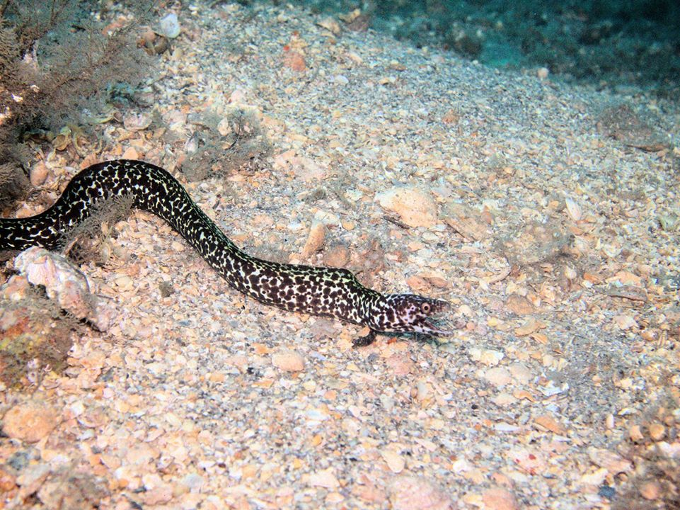
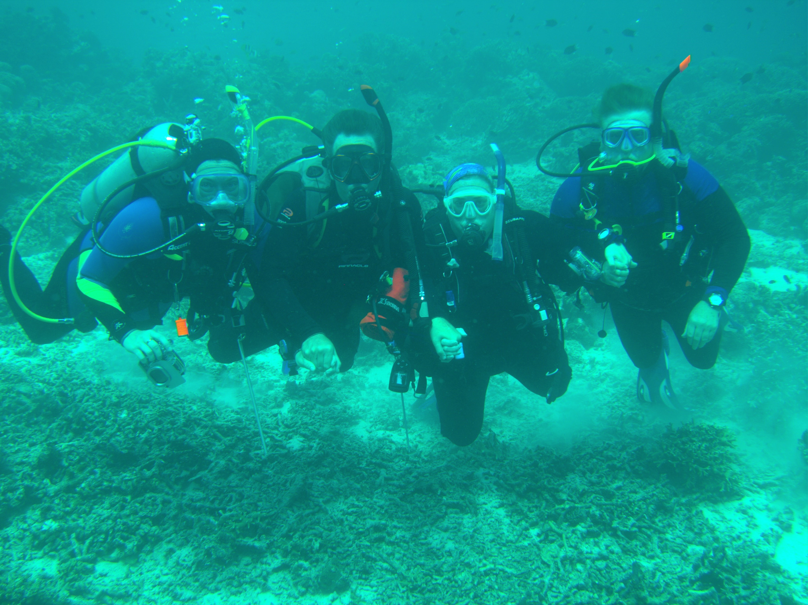

::: {w3-include-html="navsite.html"}
:::

::: {.w3-row .w3-border}
::: {.w3-container .w3-light-blue}
2020 Meetings {#meetings .w3-text-shadow .w3-center}
=============

::: {.w3-container}
#### Wednesday, November 4 at Virtual Happy Hour at 7:00 pm, Virtual Meeting at 7:30 pm

Ben Scheelk with the Ocean Foundation will talk and show pictures of
their Sea Grass Grow program. The SeaGrass Grow campaign is a carbon
offset program that allows people to purchase carbon offset credits that
funds seagrass planting. Seagrass habitats are up to 45 times more
effective than the most pristine Amazonian rainforest in their carbon
uptake abilities and provide protection and shelter to ocean habitat.
For every \$1 invested in coastal restoration projects, \$15 in net
economic benefits is created. By utilizing this unique carbon offset
program, The Ocean Foundation has been able to combat ocean
acidification, a result of carbon produced climate change, as well as
help restore ocean habitat, and support the local communities that
depend on ocean health.

{width="40%"}

Photo Credit: Ben Scheelk, Ocean Foundation
:::

::: {.w3-container}
#### Wednesday, October 7 at Virtual Happy Hour at 7:00 pm, Virtual Meeting at 7:30 pm

We will start the vitual meeting with a \"happy half-hour\" at 7:00.
Enjoy your cocktail/mocktail while watching a thrilling episode of Sea
Hunt.

Club business will start at 7:30, afterwards Marc will present \"Life
Aboard the Titanic" Once heralded as the grand, unsinkable ocean liner
of the sea in 1912, the RMS Titanic sailed into legend after striking an
iceberg and disappearing into oblivion, more than two miles on the ocean
floor. Seventy-three years later, scientists discovered the dead wreck
only to uncover a hidden ecosystem of sea life, from finless fish to
wood-boring organisms. Board the RMS Titanic once again to discover the
unique lifeforms that have inhabited the legendary ocean liner for more
than century.

{width="40%"}

\(C\) National Geographic, 2012
:::

::: {.w3-container}
#### Wednesday, September 2 at Virtual Happy Hour at 7:00 pm, Virtual Meeting at 7:30 pm

We will start the vitual meeting with a \"happy half-hour\" at 7:00.
Enjoy your cocktail/mocktail while watching a thrilling episode of Sea
Hunt.

Club business will start at 7:30 afterwards Mike will give us the scoop
on diving at Lake Phoenix, which used to be called Lake Rawlings.
:::

::: {.w3-container}
#### Wednesday, August 5 at Virtual Happy Hour at 7:00 pm, Virtual Meeting at 7:30 pm

We will start the vitual meeting with a \"happy half-hour\" at 7:00.
Enjoy your cocktail/mocktail while watching a thrilling episode of Sea
Hunt.

Club business will start at 7:30 afterwards Jason Frohnmayer will
present NOAA's involvement with Marine Protected Areas.
:::

::: {.w3-container}
#### Wednesday, July 1 at Virtual Happy Hour at 7:00 pm, Virtual Meeting at 7:30 pm

During the cocktail/mocktail hour at 7:00 PM, we will watch an episode
of Sea Hunt. We will cover club business at 7:30 PM. After club
business, Sarah will present information to us about the [Ocean
Foundation's SeaGrass
Grow](https://oceanfdn.org/projects/seagrass-grow/) program. Next, we
will watch some some [diving
videos](https://www.youtube.com/channel/UCNGhhtOKT7OaRYJw2Pfs3zg)
produced by WK, a fellow diver that club members met on the trip to the
Solomon's last November.
:::

::: {.w3-container}
#### Wednesday, June 6 at Virtual Happy Hour at 7:00 pm, Virtual Meeting at 7:30 pm

We will start the vitual meeting with a \"happy half-hour\" at 7:00.
We\'ll also have time before this to help people set up their computer
or smart phone.

Liz will present pictures from her recent dive trip to Turneffe Island
in Belize. Gloria has some whale pictures from Tahiti.

{width="40%"}
{width="40%"}
:::

::: {.w3-container}
#### Wednesday, May 6

We will start the vitual meeting with a \"happy half-hour\" at 7:00.
We\'ll also have time before this to help people set up their computer
or smart phone.

This is a chance for members who cannot drive to our meeting to join us
from home.

Paul, Bruce B. and Ed will give a report and show pictures from their
pre-stay-at-home/pre-social-distancing trip to the Blue Heron Bridge at
Riviera Beach, Florida. We will have an update on the closure status of
Phil Foster Park.

{width="20%"}
{width="20%"}
{width="20%"}
{width="20%"}
:::

::: {.w3-container}
#### Wednesday, April 1 at 7:30 pm

We will start the vitual meeting with a \"happy half-hour\" at 7:00.
We\'ll also have time before this to help people set up their computer
or smart phone.

This is a chance for members who cannot drive to our meeting to join us
from home.
:::

::: {.w3-container}
#### Wednesday, March 4 at 7:30 pm

Bill and Nadine Beard from [Bill Beard's Costa Rica Scuba Diving &
Adventure Travel Company](https://www.billbeardcostarica.com) will talk
about sustainable diving and adventure tourism in Costa Rica. Bill was
the first scuba diving instructor in the country, had the first
professional dive shop and dive boat offering daily dive trips in the
Pacific Ocean.

{width="20%"}
:::

::: {.w3-container}
#### Wednesday, February 5 at 7:30 pm

Kris, Paul, and Sarah will show pictures from their live aboard dive
trip to the Solomon Islands.

{width="25%"}
:::

::: {.w3-container}
#### Wednesday, January 8 at 7:30 pm

Andrew will share his experiences diving with a rebreather. He will
bring his current rebreather and show pictures.
:::

::: {.w3-container}
We will also discuss future club dive trips.
:::
:::

::: {.w3-container}
Where We Dive
-------------

The short answer is anywhere. Club dive trips can be two divers or a
dozen. Our recent dive trips include local quarries, West Palm Beach,
Cozumel, Puerto Rico, Belize, St. Vincent, Palau, Sidapan, the
Philipines, and Indonesia.
:::

::: {w3-include-html="footer.html"}
:::
:::
