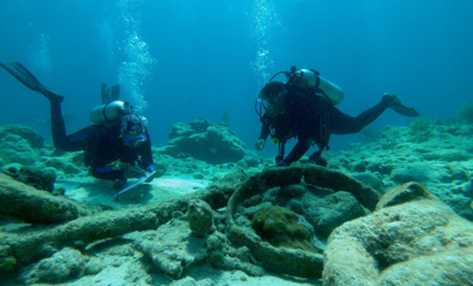

::: {w3-include-html="navsite.html"}
:::

::: {.w3-row .w3-border}
::: {.w3-container .w3-light-blue}
2022 Meetings {#meetings .w3-text-shadow .w3-center}
=============

#### Monthly Meetings {#monthly-meetings .w3-center}

**Recent Changes:**Patowmack Divers has switch to meeting the first
Monday of the month, unless it\'s a federal holiday. We are now holding
hybrid meetings giving divers the option of joining us at Mylos\'s or on
Zoom. We will have a social half hour starting at 7:00 pm. This is a
chance watch Seahunt, to talk, order drinks and food, etc. The meeting
will start with club business at 7:30. Our meetings usually end between
9:00 and 9:30 pm.

You can download a free copy of Zoom by clicking on this link:
<https://zoom.us/support/download> You can also download a copy from the
Apple App Store and Google Play. We will email information on how to
connect to our meeting later. Even if you have used Zoom before, you may
have to download a new version. Zoom has made security improvements and
required the new version, Zoom 5.0, starting May 30.

2021 Meetings {#meetings-1 .w3-text-shadow .w3-center}
=============

::: {.w3-container}
::: {.w3-container}
#### **Monday, November 1, 2021**\--Virtual Happy Hour at 7:00 pm, Virtual Meeting at 7:30 pm

Those who wish to join in person can do so at Mylo\'s Restaurant (for
those who are fully vaccinated). As we did last month, we will also have
a Zoom space operating.

We will have a cocktail & mocktail (half) hour at 7 PM (either in person
or on the Zoom). We will cover club business at 7:30 PM.

Following club business, Ernie Franklin will give a presentation about
the activities of the Diving with a Purpose (DWP) organization. DWP
(<https://divingwithapurpose.org/>) is a leading international
organization that provides education and training programs, mission
leadership, and project support services for submerged heritage
preservation and conservation projects worldwide with a focus on the
African Diaspora. Born in Michigan, Ernie Franklin
(<https://uasdivers.org/ernie-franklin/>) was scuba certified by the
Under Water Adventure Seekers Club (UAS) of Washington DC. The
Underwater Adventure Seekers Club created in 1959 is the founding club
of the National Association of Black Scuba Divers A graduate of the
Tuskegee Institute, he\'s a PADI certified Open Water Dive Instructor, a
Scientific Diver for both NOAA and for the American Academy of
Underwater Sciences (AAUS) and Education Director for the Youth program
at Diving with a Purpose.

{width="40%"}
{width="40%"}

Also, since we recently had a presentation on Great Lakes diving, club
members might find these two links interesting reading:

<https://oceanexplorer.noaa.gov/explorations/18aviatorsdown/welcome.html>\
[https://www.pressandguide.com/2021/09/23/lake-huron-red-tails-recovering-michigans-history-of-the-tuskegee-airmen.](https://www.pressandguide.com/2021/09/23/lake-huron-red-tails-recovering-michigans-history-of-the-tuskegee-airmen)
:::

::: {.w3-container}
#### Wednesday, June 3, 2021\--Virtual Happy Hour at 7:00 pm, Virtual Meeting at 7:30 pm

**Macro photography in South Florida by Ariane Dimitris.** Following
club business, Ariane Dimitris will present. Ari is an avid diver and
underwater photographer in South Florida. She will present macro shots
from her many diving adventures.
:::

::: {.w3-container}
#### Wednesday, May 7, 2021\--Virtual Happy Hour at 7:00 pm, Virtual Meeting at 7:30 pm

Divers know our reefs are under threat, but you can help protect them
(and yourself) every time you apply sunscreen. Ingredients like
oxybenzone, parabens and mineral oils in sunscreens and body-care
products can harm our oceans, rivers, lakes and streams. Studies have
shown that coral-reef damage can be caused by these ingredients and they
are making their way into the waterways and popular reefs in
surprisingly high concentrations. Join us as we welcome Mike Materre,
Vice President of Stream2Sea, who will tell the story of the development
of this reef-safe sunscreen and body-care products company founded in
2015 by Autumn Blum, a cosmetic chemist and scuba diver. Where: Zoom
information will be sent at a later time.

For some background information, there an article from the MIT alumni
association
[here](https://alum.mit.edu/slice/protecting-worlds-vanishing-coral-reefs?utm_source=techconnection&utm_medium=email&utm_campaign=slice)

{width="40%"}
{width="40%"}
:::

::: {.w3-container}
#### Wednesday, April 7, 2021\--Virtual Happy Hour at 7:00 pm, Virtual Meeting at 7:30 pm

**Mike Evermore** will discuss invasive species in quaries. Where: Zoom
information will be sent at a later time
:::

::: {.w3-container}
#### Wednesday, March 3, 2021\--Virtual Happy Hour at 7:00 pm, Virtual Meeting at 7:30 pm

After club business, **Sandra Edwards** will show pictures from under
the **Blue Heron Bridge** in West Palm Beach. The water under BHB
abounds in small creatures such as **nudibranchs** and Sandra has spent
many productive dives finding them and photographing them. See her
pictures on Facebook\'s *Underwater Macro in the Americas* group.

Where: Zoom information will be sent at a later time

{width="40%"}
{width="40%"}
:::

::: {.w3-container}
#### Wednesday, February 3, 2021\--Virtual Happy Hour at 7:00 pm, Virtual Meeting at 7:30 pm

After club business, our own Gloria Freund will unveil the new
director's extended cut of "Carnal Capers of the Giant Cuttlefish."
Where: Zoom information will be sent at a later time
:::

::: {.w3-container}
#### Wednesday, January 6, 2021\--Virtual Happy Hour at 7:00 pm, Virtual Meeting at 7:30 pm

Our January meeting was canceled. Gloria\'s presentation will be at our
February meeting.

After club business, our own Gloria Freund will unveil the new
director's extended cut of "Carnal Capers of the Giant Cuttlefish."
Where: Zoom information will be sent at a later time
:::
:::

::: {w3-include-html="footer.html"}
:::
:::
:::
